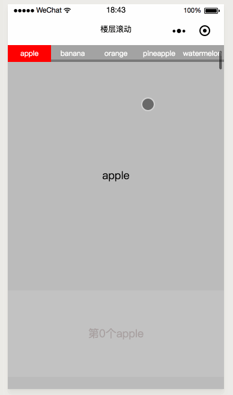

# wepy-scroll
微信小程序楼层跳跃, 滚动楼层. 滚动商品时触发分类切换, 商品分类联动

# 运行
npm install

npm run dev

用微信开发工具打开目录下的dist文件夹



## position: sticky;
改新属性可以让一个元素在滚动到顶部是自动吸顶, 类似于fixed, 只是之前我们的做法都是使用fixed(需要检测滚动距离,消耗cpu性能), 
必须要给定top right left bottom 任意一个属性的值.
## 使用scroll-view, 
让scroll-view里面的元素使用sticky属性自动吸顶, 必须要使用一个view作为父元素将scroll-view里的元素都包住, 不然
在滑动一整个屏幕的高度之后吸顶的元素会被顶走
```html
  <view>
    <scroll-view class="category-scroll" 
      scroll-into-view="{{scrollInTo}}" 
      bindscroll="scrolling" 
      scroll-with-animation="true" scroll-y="true">
      <view>
        <view class='cs-banner'>banner</view>
        <view class="cs-fix">
          <view>
            <repeat for="{{fruits}}" key="index">
              <view class="cate {{currentCategory==index?'selected':''}}" 
                @tap.stop="clickScrollInTo" 
                data-name="{{item.name}}">{{item.name}}</view>
            </repeat>
          </view>
        </view>
        
        <view class="products" id="prds">
          <repeat for="{{fruits}}" key="index" item="item" index="index">
            <view class="product" id="{{item.name}}">{{item.name}}</view>
            <view class="productBox" wx:for="{{item.num}}" wx:for-item="itm" wx:key="idx" wx:for-index="idx">
              第{{idx}}个{{item.name}}
            </view>
          </repeat>
        </view>
      </view>
    </scroll-view>
  </view>
```

## scroll-view属性

scroll-into-view="{{scrollInTo}}"  可以跳转到scroll-view里的某个元素, 根据id
bindscroll="scrolling"  scroll-view滚动时会触发该函数
scroll-with-animation="true"  滚动时会有缓动动画
scroll-y="true"  允许纵向滚动


## js逻辑
```JavaScript
import wepy from 'wepy'

export default class categoryScroll extends wepy.page {
  config = {
    navigationBarTitleText: '楼层滚动'
  }
  components = {}

  data = {
    fruits: [
      {name: 'apple', num: [0, 1, 2, 3, 4, 5, 6, 7, 8, 9]},
      {name: 'banana', num: [0, 1, 2, 3, 4, 5, 6, 7, 8, 9]},
      {name: 'orange', num: [0, 1, 2, 3, 4, 5, 6, 7, 8, 9]},
      {name: 'pineapple', num: [0, 1, 2, 3, 4, 5, 6, 7, 8, 9]},
      {name: 'watermelon', num: [0, 1, 2, 3, 4, 5, 6, 7, 8, 9]}
    ],
    // 当前分类的索引
    currentCategory: 0,
    // 每个分类距离顶部的高度的数组
    productsTop: [],
    categoryTop: 10000,
    // 用于存储每次滚动结束之后的距离, 可用来判断滚动的方向
    moveStartPos: 0,
    // 点击分类的名称, 用于点击跳转
    scrollInTo: ''
  }

  computed = {}

  // onPageScroll (e) { s
  onScrollViewScroll (e) {
    // 当前滚动的距离
    let scrollTop = e.scrollTop
    // moveStartPos记录着上一次滚动完成时的位置, 用于判断滚动方向
    // 如果现在的滚动距离大于moveStartPos说明正在往下滚动
    if (scrollTop > this.moveStartPos) {
      this.moveStartPos = scrollTop
      // 遍历每个商品距离顶部的距离
      this.productsTop.forEach((item, index) => {
        // 如果滚动的距离大于某个商品到顶部的距离说明该商品到了顶部, 减10是为了减少触发距离
        if (scrollTop > item.top - 10) {
          // 当前分类的索引小于满足条件的商品索引就赋值, 跳到下一个分类
          if (this.currentCategory < index) {
            this.currentCategory = index
            this.$apply()
          }
        }
      })
    // 如果现在的滚动距离小于moveStartPos说明正在往上滚动    
    } else if (scrollTop < this.moveStartPos) {
      this.moveStartPos = scrollTop
      this.productsTop.forEach((item, index) => {
        if (scrollTop < item.top - 10) {
          if (this.currentCategory >= index) {
            this.currentCategory = index ? index - 1 : index
            this.$apply()
          }
        }
      })
    }
    this.$apply()
  }

  methods = {
    // scroll-view滚动时触发
    scrolling (e) {
      // 将当前的距离传入
      this.onScrollViewScroll({scrollTop: e.detail.scrollTop})
    },
    // 点击分类跳转
    clickScrollInTo (e) {
      this.scrollInTo = e.currentTarget.dataset.name
      this.$apply()
    }
  }

  onReady () {
    // 页面准备完成之后获取每个分类距离顶部的高度, 存储在数组productsTop中
    var query = wx.createSelectorQuery()
    this.productsTop = []
    query.selectAll('.product').boundingClientRect((rect) => {
      rect.forEach((item, index) => {
        this.productsTop.push({top: item.top})
      })
      this.$apply()
    })
    
    query.selectAll('.cs-fix').boundingClientRect((rect) => {
      this.categoryTop = rect[0].top
      this.$apply()
    }).exec()
  }
}
```

